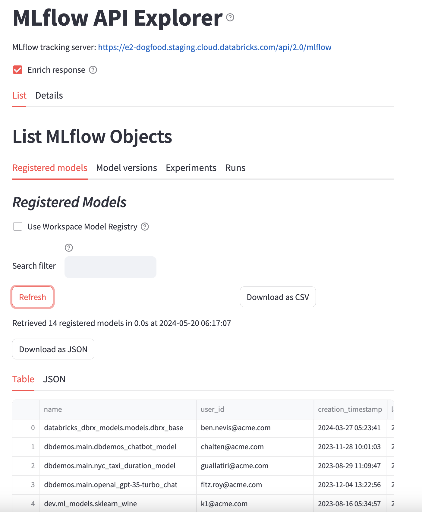
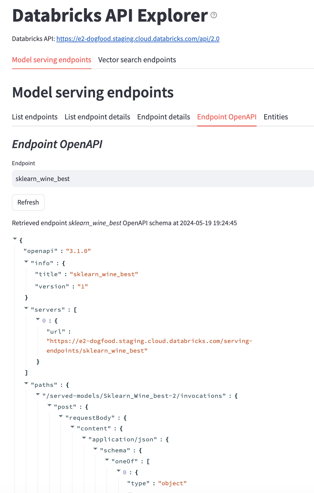

# MLflow Reports - Streamlit

Experimental Streamlit MLflow and Databricks Explorer UI.

### Overview

Display the results of REST API calls to MLflow and Databricks endpoints in a Streamlit app.

#### Scripts
* [mlflow_explorer.py](mlflow_reports/streamlit/mlflow_explorer.py) - list and search MLflow objects.
  * Registered models, model versions, experiments and runs.
  * Both for open source and Databricks MLflow.
* [list_databricks_endpoints.py](mlflow_reports/streamlit/list_databricks_endpoints.py) - list and search Databricks endpoints.
  * Model serving endpoints and their entities, vector search endpoints and vector search indexes.


#### Where can you run the scripts
* Can run either against an open source MLflow or Databricks tracking server.
* Can run either on your laptop or inside a Databricks notebook.

#### How to run the scripts
* Point to the script as raw Github URI.
* Point to the script on the file system.

### Setup
```
pip install git+https:///github.com/amesar/mlflow-reports/#egg=mlflow-reports[streamlit]
```

### Quickstart

```
export MLFLOW_TRACKING_URI=databricks://my_profile

streamlit run https://raw.githubusercontent.com/amesar/mlflow-reports/master/mlflow_reports/streamlit/mlflow_explorer.py

streamlit run https://raw.githubusercontent.com/amesar/mlflow-reports/master/mlflow_reports/streamlit/databricks_explorer.py

```
### Runing inside Databricks Notebook

* See [databricks_notebooks](databricks_notebooks/streamlit) folder.
* [Streamlit_MLflow_Explorer.py](databricks_notebooks/streamlit/Streamlit_MLflow_Explorer.py).
* [Streamlit_Databricks_Explorer.py](databricks_notebooks/streamlit/Streamlit_Databricks_Explorer.py).
* Great thanks to https://github.com/stikkireddy/dbtunnel for making Streamlit apps run inside notebooks.


### Run on laptop

#### Run against a local MLflow tracking sever

##### Run as raw Github URI
```
export MLFLOW_TRACKING_URI=http://localhost:5020
streamlit run https://raw.githubusercontent.com/amesar/mlflow-reports/master/mlflow_reports/streamlit/mlflow_explorer.py
```

##### Run as file system script
```
export PYTHONPATH=.
export MLFLOW_TRACKING_URI=http://localhost:5020
streamlit run mlflow_reports/streamlit/mlflow_explorer.py
```

#### Run against a Databricks server with profile

Profile is `e2_demo_fieldeng`.
```
export MLFLOW_TRACKING_URI=databricks://my_profile
streamlit run https://raw.githubusercontent.com/amesar/mlflow-reports/master/mlflow_reports/streamlit/mlflow_explorer.py
```

#### Run against a Databricks server without profile
```
export DATABRICKS_HOST=https://e2-my-workspace.mycompany.com
export DATABRICKS_TOKEN=MY_TOKEN
streamlit run https://raw.githubusercontent.com/amesar/mlflow-reports/master/mlflow_reports/streamlit/mlflow_explorer.py
```

## Samples




